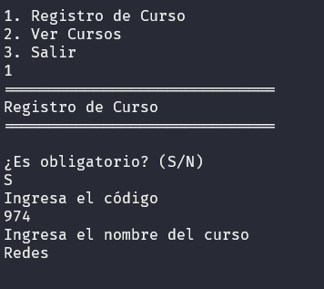
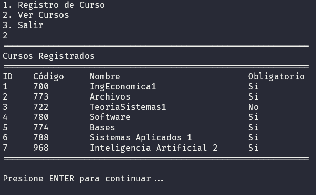

# Universidad de San Carlos de Guatemala
## Ingeniería en Ciencias y Sistemas de la Computación
### Laboratorio - Manejo e Implementación de Archivos
### Sistema de Registro de Cursos en Archivo Binario

#### Introducción
Esta pequeña aplicación permite el registro y visualización de cursos. Se utiliza un archivo binario para persistir la información.

#### Funciones Principales
- **Registro de Curso** 

    

- **Ver Cursos**

## Requerimientos del Entorno de Desarrollo 🔧
* **Lenguaje de programación**: GO 1.22.0
* **IDE utilizada**: Visual Studio Code 1.86.0

### Soporte y Ayuda
Para asistencia o problemas técnicos, contacte al programador de la aplicación [Lino García Vallejo](mailto:2274031850101@ingenieria.usac.edu.gt). 

~~~
Universidad San Carlos de Guatemala 2024
Estudiante: Lino Antonio García Vallejo
Carné: 9017323
~~~